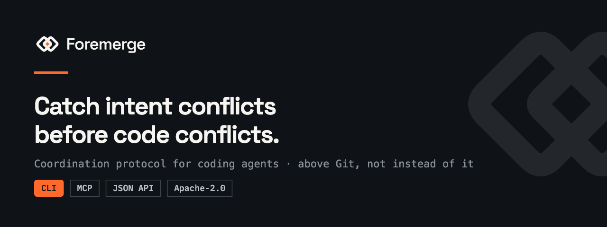

<h1>Foremerge</h1>

<p align="center">
  
</p>

[](https://github.com/naw103/foremerge/actions/workflows/ci.yml)
[](https://crates.io/crates/foremerge)
[](LICENSE)

Foremerge is the open-source coordination protocol for coding agents, built
above Git. Agents keep isolated worktrees while sharing intent, semantic
claims, dependencies, provisional ChangeSets, decisions, validation, and
provenance.

| [**Tell your agent to install**](#quickstart-first-conflict-in-under-five-minutes) | → | **Done** | → | **See collisions before they land** |
| :---: | :---: | :---: | :---: | :---: |
| Paste one line into Claude Code, Codex, or Cursor | | It installs Foremerge and wires itself up | | Every agent sees what the others are about to change, even in separate worktrees |

> **Status:** Foremerge `0.4.0` is a pre-1.0, local-first MVP. The CLI, JSON API,
> MCP server, SQLite store, deterministic conflict detector, and
> verification-gated lifecycle are implemented. Public schemas may still
> change. Shared multi-machine mode and published benchmark results do not yet
> exist.

## How it works

Say you have two AI agents working on the same project at the same time. Each
one gets its own copy of the code, so they never fight over files. Both finish.
Both look correct. Then you find they undid each other's work.

Git cannot warn you about that, because Git compares text and not intent. It
will stop you when two agents edit the same part of the same file. What it
cannot see is two edits that are each perfectly reasonable on their own and
land in different files. If one agent moves every caller onto a new
`StripePaymentService` while another adds PayPal support to the old
`PaymentService`, nothing overlaps, so Git merges both without complaint and
the PayPal work is left stranded on a class nothing calls any more.

Foremerge fixes this by having agents announce what they are about to do,
before they do it.

1. **Each agent says what it is about to touch.** Not the code, just the
   target, like "I am going to change the `sendEmail` function."
2. **Every agent reads from one shared list.** It is a small database inside
   your project's `.git` folder, so every agent on your machine sees the same
   picture, whether it is Claude, Codex, or Cursor.
3. **If two plans collide, you hear about it right away.** Foremerge names the
   two agents, explains why their plans clash, and suggests how to split the
   work. Both worktrees are still clean at that point, so no work has to be
   thrown away.

Think of it as a shared whiteboard. Before an agent starts, it writes down what
it is about to work on, and it reads what everyone else already wrote.

Two things Foremerge deliberately does not do. It never locks a file or blocks
an agent, because a single crashed agent would then stall the whole fleet, so
the warnings are advisory and you stay in charge. And it never asks a model to
judge conflicts, so the same inputs always produce the same answer.

## The conflict Git cannot see yet

```text
Agent A: Replace PaymentService with StripePaymentService
Agent B: Add PayPal support to PaymentService
```

These agents can work in different trees without touching the same line. The
plans still collide: one removes the extension point while the other depends on
it.

Both agents declare the same `symbol:PaymentService` scope, one saying it will
`replace` it and the other that it will `extend` it. Foremerge compares those
two declarations before either writes code, raises a `HIGH` advisory, and
suggests coordinating on a stable abstraction such as `PaymentProvider`. That
suggestion is explainable evidence, not an automatic architecture decision or a
hard lock.

Because the operation is declared rather than read out of the summary, it does
not matter how either agent phrased its plan. "Consolidate payments onto
Stripe" and "Replace PaymentService with Stripe" reach the same verdict.

Git remains the durable repository. Foremerge supplies the missing shared
awareness above it.


_Rendered from the actual conflict fields captured by the `0.1.0`
release-binary run in
[`examples/terminal-session.txt`](examples/terminal-session.txt). The displayed
command uses the shown `jq` filter; output is abridged for readability._

## Quickstart: first conflict in under five minutes


### Let your coding agent do it

Paste this into Claude Code, Codex, or Cursor from inside the repository you
want to coordinate:

```text
Set up Foremerge in this repository so we can coordinate parallel agents.

1. Install it:      curl -fsSL https://foremerge.com/install.sh | sh
2. Initialize:      foremerge init
3. Wire this client and any others in use: foremerge setup all
4. Register the check I should be validated against, for example:
                    foremerge checks set test -- cargo test --all-targets
5. Confirm:         foremerge doctor --client all

Then read the Foremerge skill that step 3 installed for this client and follow
it from now on: publish your intent with semantic scopes before editing, claim
the scope, and check for conflicts before you start.
```

Adjust step 4 to whatever this repository's real test command is. Step 3 asks
the client to enable an MCP server, so it will prompt you before doing so. The
Codex registration is user level, but one registration serves every repository:
start Codex inside the repository you want it to coordinate.

### Or do it yourself

You need a recent Git and `jq`. Install a prebuilt, checksum-verified release
binary (macOS and Linux; the script installs to `~/.local/bin`):

```sh
curl -fsSL https://foremerge.com/install.sh | sh
```

> [!TIP]
> **Two commands, one program.** This installs `foremerge` and `fmg`, the same
> binary under a shorter name, so `fmg status` and `foremerge status` do the
> same thing. Examples below spell out `foremerge`; type whichever you prefer.

Or build from source with Rust 1.85+: `cargo install --locked --git
https://github.com/naw103/foremerge foremerge`, or `cargo install --locked
--path .` from a checkout. Windows binaries are on the
[releases page](https://github.com/naw103/foremerge/releases). To update,
re-run the installer. Then, inside the repository you want to coordinate:

```sh
foremerge init
foremerge doctor
```

The installer, the release archives and `cargo install` all carry both names
from 0.4.0 onward. If something else on your PATH already answers to `fmg`, the
installer leaves it alone and says so rather than shadowing it.

Install the native skill and MCP entry for any clients used in this repository,
then define the trusted checks agents may request by name:

```sh
foremerge setup all
foremerge checks set test -- cargo test --all-targets
foremerge doctor --client all
```

Acceptance is verification-gated: Foremerge runs the check itself rather than
taking an agent's word for it. Pick a check that is fast and that would actually
catch a broken handoff, such as a build or a typecheck, rather than a full CI
suite; this gate decides whether other agents may treat the work as done, and it
does not replace CI. If this repository has nothing meaningful to verify, say so
once rather than registering a check that always passes:

```sh
foremerge checks policy advisory
```

Work accepted that way is recorded as `UNVERIFIED` with the reason, so the audit
trail never implies a check ran when none did. `foremerge doctor` reports
whether the registered checks can actually run here, which matters in agent
worktrees, because dependency directories are usually gitignored and
`git worktree add` will not create them.

Use `setup codex`, `setup claude`, or `setup cursor` for one client. Setup
preserves unrelated configuration (including key order in project MCP JSON).
Upgrading Foremerge refreshes its own unedited skill file in place, but a skill
file you edited, or a differing Foremerge MCP entry, is never replaced unless
you explicitly pass `--force`. `setup all` attempts every client and reports each
result, exiting nonzero if any failed. The Codex MCP registration is user-level
and serves every repository, resolved from the directory Codex is started in;
see [agent client setup](docs/agent-clients.md).

`init` creates local coordination state under the repository's Git common
directory. It does not change tracked files. The following no-worktree sessions
are enough to exercise pre-code detection; real coding agents should register
their isolated worktrees and actual model identifiers.

```sh
STRIPE_AGENT=$(
  foremerge --json agent register \
    --name stripe-agent \
    --no-worktree |
  jq -er '.data.id'
)

STRIPE_RESULT=$(
  foremerge --json intent publish \
    --agent "$STRIPE_AGENT" \
    --task "modernize-payments" \
    --summary "Replace PaymentService with StripePaymentService" \
    --scope symbol:PaymentService=replace
)
STRIPE_INTENT=$(printf '%s\n' "$STRIPE_RESULT" | jq -er '.data.intent.id')

PAYPAL_AGENT=$(
  foremerge --json agent register \
    --name paypal-agent \
    --no-worktree |
  jq -er '.data.id'
)

PAYPAL_RESULT=$(
  foremerge --json intent publish \
    --agent "$PAYPAL_AGENT" \
    --task "add-paypal" \
    --summary "Add PayPal support to PaymentService" \
    --scope symbol:PaymentService=extend
)
PAYPAL_INTENT=$(printf '%s\n' "$PAYPAL_RESULT" | jq -er '.data.intent.id')

printf '%s\n' "$PAYPAL_RESULT" |
  jq '.data.conflicts[] | {kind, severity, scope, explanation, suggestion}'

printf '%s\n' "$PAYPAL_RESULT" |
  jq '.data.related_work[] | {agent, summary, asserted, overlap}'
```

The first command prints the live finding from your local run. The second
prints `related_work`: the other agent's intent and every overlapping scope
with both declared operations. Foremerge states what overlaps; you decide what
it means and record that with `foremerge assess record`. No files need to
change first. Inspect the captured, clearly labeled transcript in
[`examples/terminal-session.txt`](examples/terminal-session.txt).

Claims add ownership context without blocking either agent:

```sh
foremerge --json work claim \
  --agent "$STRIPE_AGENT" \
  --intent "$STRIPE_INTENT" \
  --scope symbol:PaymentService \
  --reason "Changing the provider boundary" >/dev/null

foremerge --json work claim \
  --agent "$PAYPAL_AGENT" \
  --intent "$PAYPAL_INTENT" \
  --scope symbol:PaymentService \
  --reason "Adding another provider" |
  jq '.data | {advisory_only, warnings}'

foremerge --json work query --scope symbol:PaymentService |
  jq '.data[] | {agent: .agent.name, intent: .intent.summary, open_conflicts}'
```

Both claims succeed. The second response includes an overlap warning because a
claim is a leased advisory, never exclusive ownership.


_Recorded against the released 0.4.0 binary; every command and its output is real._

## How it fits above Git

```text
  coding agent A                                  coding agent B
        |                                               |
  isolated worktree A                            isolated worktree B
        |                                               |
        +--------- semantic events, not edits ----------+
                              |
                    CLI / MCP / JSON API
                              |
                     Foremerge service
                    /        |        \
       SQLite coordination   git CLI   validation argv
       in <git-common-dir>       |           |
                    \         Git repository /
                     durable commits and refs
```

Every frontend uses the same service and store. The semantic graph is:

```text
Agent → Task → Intent → Claim → Symbol → Dependency
      → ChangeSet → Test → Result → Decision → Provenance
```

Mutations update typed SQLite projections, materialize graph edges, and append a
hash-chained semantic event in one transaction. The log is useful tamper
evidence; it is not a remote identity signature or distributed consensus.

## Git worktrees: isolated files, shared awareness

Foremerge resolves the Git common directory and stores its default database at:

```text
<git-common-dir>/foremerge/state.sqlite3
```

Linked worktrees share that common directory even though their checked-out
files are separate. Create a worktree with Foremerge's thin wrapper around
stock Git:

```sh
foremerge worktree create \
  --branch agent/paypal \
  --path ../payments-paypal \
  --base HEAD

foremerge --cwd ../payments-paypal --json agent register \
  --name paypal-agent \
  --model "$ACTUAL_MODEL_ID"
```

Another worktree in the same repository sees the registered agent and its
intents immediately. You can override storage with `--database PATH` or
`FOREMERGE_DB`, but every local agent must point at the same database to share
state. The MVP does not replicate SQLite across machines; do not infer
distributed safety from a network-mounted database.

Foremerge snapshots Git state for ChangeSet fingerprints and accepted refs. It
does not automatically merge, rebase, cherry-pick, push, or update a target
branch.

## Semantic workflow

```text
INTENT ─claim→ CLAIMED ─start→ IN_PROGRESS ─publish→ PROVISIONAL
       ─validate current fingerprint→ VALIDATED
       ─accept gates→ ACCEPTED ─record Git ref→ COMMITTED
```

Supported scope kinds are:

```text
symbol api schema config infra test migration env file component contract domain
```

Publish the narrowest useful semantic scope. File paths alone miss API,
configuration, schema, infrastructure, and cross-language collisions.

Common commands:

| Boundary | Command |
| --- | --- |
| Register provenance | `foremerge agent register --name NAME --model MODEL` |
| Publish intent | `foremerge intent publish --agent ID --task TASK --summary TEXT --scope KIND:KEY=OPERATION` |
| Claim scope | `foremerge work claim --agent ID --intent ID --scope KIND:KEY` |
| Start implementation | `foremerge work start INTENT_ID --agent AGENT_ID` |
| Ask who is changing it | `foremerge work query --scope KIND:KEY` |
| See what every agent is doing | `foremerge status` |
| Preflight a plan | `foremerge conflicts check --intent TEXT --scope KIND:KEY=OPERATION` |
| Record what you concluded | `foremerge assess record --agent ID --intent ID --related-intent-id ID --verdict V --rationale TEXT --action A` |
| Send coordination | `foremerge coordinate send --from ID --to ID --message TEXT` |
| Watch semantic events | `foremerge work watch --after-seq 0` |
| Log in and link through device authorization | `foremerge cloud login --base-url URL` |
| Link a cloud project | `foremerge cloud link --project ID --base-url URL` |
| Inspect cloud lag/coverage | `foremerge cloud status` |
| Deliver already-queued cloud commands | `foremerge cloud flush` |
| Pull verified cloud state | `foremerge cloud sync` |
| Revoke and remove a connector credential | `foremerge cloud logout` |

Run `foremerge <command> --help` for the complete current flags. Global flags
such as `--json`, `--cwd`, and `--database` may appear before or after
subcommands.

## Foremerge Cloud connector

The first cloud connector links one Git repository to a project, verifies the
cloud event sequence and hash chain, caches those canonical events in SQLite,
reduces canonical agent registrations and intent publications into typed local
projections, and publishes those same two mutations through a durable receipt
barrier. The standalone workflow remains unchanged when the repository is
unlinked:

```sh
foremerge cloud login --base-url https://cloud.foremerge.com
foremerge --json cloud flush
foremerge --json cloud sync
foremerge --json cloud status
foremerge cloud logout
```

Interactive login stores access/refresh material only in the operating-system
credential store and puts a nonsecret `keyring:fmc_...` locator in repository
configuration. There is no plaintext fallback when the keyring is unavailable.
Explicit `env:FOREMERGE_CLOUD_TOKEN` references remain supported for hosted/CI
use. Tokens never enter Git configuration, SQLite, output, errors, or logs.
Link config version 2 points at an immutable SQLite generation binding the
service, tenant, connector, project, and origin. Refresh uses a per-link SQLite
lease and a stable keyring-only rotation id, so concurrent callers cannot race
and a replayed rotation response retains its original authoritative issuance
time. Login persists its device flow before prompting, resumes the same device
code after a restart or truncated response, and performs one idempotent refresh
before link activation. The service revokes an unacknowledged connector when
its consumed-device replay is pruned; the subsequent rotation replay remains a
bounded recovery window (currently about ten minutes) pending a distinct
pre-alpha rotation acknowledgement. `cloud logout` recovers any in-flight rotation before no-oracle revocation
and removes the local keyring item only after remote acceptance; explicitly
named `--local-only` cleanup is available when offline. Login also writes a
nonsecret pending-auth recovery pointer before activating the link. If link
activation and immediate revocation both fail, `cloud status` exposes that
state and `cloud logout` can retry with the keyring-held token even though no
link exists. Keyring-backed links require logout before unlink; environment
links retain the existing unlink behavior. When retained events no longer
cover the local cursor, sync verifies a tenant-bound Ed25519 snapshot from the
server's well-known key before pulling the remaining tail. Status reports both
the verified-cache and applied-projection heads, their lag, staleness,
retention, project/head metadata, and whether coverage starts at genesis or a
verified snapshot.

For those two mutations, the local attempted record and immutable command
envelope commit in one SQLite transaction. CLI, MCP, and loopback JSON API
calls report success only after a matching immutable cloud receipt; if delivery
is unavailable, they return `CLOUD_MUTATION_DEGRADED` while preserving the
local attempt and queued command for `cloud flush` recovery. Automatic delivery
uses one two-second wall-clock deadline across HTTP retries and backoff, then
releases its lease to immediately retryable pending state. Explicit
`cloud flush` retains its independently configurable timeout. Agent envelopes
exclude the local worktree path. Intent envelopes exclude free-form rationale
and metadata, retaining only stable ids, task/summary, normalized scopes, and
dependency ids. Both command families omit the project-version precondition so
independent origins may be authoritatively re-evaluated from the same observed
head; the envelope and durable outbox retain optional CAS for future
state-sensitive commands.

This connector does **not** upload existing local history or publish/reduce
other lifecycle mutations. Canonical `agent.registered` and
`intent.published` events, plus the corresponding Agent/Intent snapshot
projections, are applied without appending duplicate local audit events.
Unknown event kinds remain verified in the immutable cache but fail closed
without advancing the projection cursor. A retention snapshot likewise remains
verified and cached, but is not reported as applied when its claims, conflicts,
or provider-observation projection is non-empty. Those boundaries are explicit in
`local_history_queued`, `mutation_mode`, `verified_cache_cursor`,
`applied_projection_cursor`, `projection_lag_events`, and
`remote_projection_applied` status fields.
`foremerge cloud unlink` refuses to strand unresolved commands or a live
keyring-managed grant, then retires only the active link and preserves local
state, verified inbound events, snapshots, receipts, outbox evidence, and
legacy quarantine. See
[Cloud connector](docs/cloud-connector.md) for the wire, trust, and recovery
details.

## ChangeSets and the verification gate

A ChangeSet captures the agent/model, task and intent, affected
files/symbols/contracts, dependencies, implementation summary, reported tests,
decisions, provenance, worktree, fingerprint, status, and Git ref.
The accepted candidate and its later landing commit are retained separately as
`accepted_commit` and `integration_commit`.

The honest integration order is:

1. Publish intent, claim semantic scope, and mark implementation in progress.
2. Work and commit on the isolated agent branch.
3. Publish a ChangeSet for that clean candidate.
4. Ask Foremerge to execute validation against its exact fingerprint.
5. Resolve high conflicts, then accept the still-clean, still-validated ref.
6. Integrate with ordinary Git or a pull request.
7. Record the durable integration commit in Foremerge.

```sh
foremerge work claim \
  --agent "$AGENT_ID" \
  --intent "$INTENT_ID" \
  --scope component:payments
foremerge work start "$INTENT_ID" --agent "$AGENT_ID"

# Implement the change and commit it on this isolated branch before publishing.
CHANGESET_ID=$(
  foremerge --json changeset publish \
    --agent "$AGENT_ID" \
    --intent "$INTENT_ID" \
    --summary "Introduce PaymentProvider and StripePaymentProvider" \
    --file src/payments.rs \
    --symbol PaymentProvider \
    --symbol StripePaymentProvider \
    --contract payment-provider \
    --provenance-json '{"source":"coding-agent"}' \
    --git-ref HEAD \
    --worktree "$PWD" |
  jq -er '.data.id'
)

foremerge changeset validate "$CHANGESET_ID" \
  --worktree "$PWD" \
  -- cargo test --all-targets

foremerge changeset accept "$CHANGESET_ID" --git-ref HEAD

# Integrate with ordinary Git, then record the commit that actually landed.
foremerge changeset commit "$CHANGESET_ID" --git-ref main
```

Agent-reported `--reported-test COMMAND=STATUS` values are provenance only.
They do not satisfy acceptance. Foremerge-owned validation records the command
argument vector, exit status, output, duration, and candidate fingerprint. Any
detected change after validation makes that attempt non-authoritative, but its
output and changed-path diagnostic remain queryable with `changeset attempts`.

For trusted checks that generate disposable untracked output, an operator may
set exact or directory-prefix rules without changing tracked files:

```sh
foremerge validation-exclusions set \
  --path coverage.log \
  --path target/validation-reports/
```

The normalized policy digest is part of the candidate fingerprint, tracked
changes are never excludable, MCP cannot change the policy, and generated files
must still be removed before acceptance. See
[ADR 0001](docs/adr/0001-validation-exclusion-rules.md).

Acceptance also requires a clean worktree and no unresolved `HIGH` conflict,
unless the caller deliberately uses the visible `--allow-high-conflicts`
override together with `--override-reason "..."`. Prefer resolving a conflict
with an explicit rationale. Acceptance creates
`refs/foremerge/accepted/<changeset-id>`; it does not merge code.

Validation commands run as trusted local code with your operating-system
permissions. Foremerge does not sandbox them.

## Agent clients and MCP: complete lifecycle tools

Run `foremerge mcp` over stdio. MCP does not require the HTTP daemon; both are
adapters over the same database.

| Tool | Purpose |
| --- | --- |
| `register_agent` | Record agent, model, capabilities, and worktree provenance |
| `publish_intent` | Announce planned work, declare what it does to each scope, and receive conflicts plus related work to assess |
| `record_assessment` | Record what you concluded about one related intent and what you will do |
| `claim_work` | Create leased advisory claims on semantic scopes |
| `query_work` | Find agents, intents, claims, ChangeSets, and conflicts |
| `check_conflicts` | Check a published or provisional intent before code changes |
| `publish_changeset` | Record implementation, tests, decisions, and Git provenance |
| `coordinate_with_agent` | Send a durable message linked to a conflict or ChangeSet |
| `start_work` | Advance claimed work into implementation |
| `resolve_conflict` | Record an audited resolution for a durable conflict |
| `run_verification` | Run a trusted repository check by name, never raw MCP argv |
| `accept_changeset` | Apply final conflict, dependency, validation, and Git gates |
| `record_commit` | Record the actual Git integration commit |
| `discard_work` | Preserve abandoned work while releasing claims and blockers |
| `list_agents` | Read registered agent provenance |
| `get_intent` | Read one intent and current conflict snapshot |
| `get_changeset` | Read one ChangeSet and Git/provenance state |
| `status` | Read one consistent coordinator status snapshot |

Start from the valid minimal config in
[`examples/mcp-config.json`](examples/mcp-config.json). It assumes the client
launches `foremerge` with the repository as its working directory. Clients
without a repository working-directory setting should pass an absolute
`--database` before `mcp`; derive the Git common directory instead of assuming
that a linked worktree's `.git` is a directory.

See [agent client setup](docs/agent-clients.md) for the installer, native skill
locations, client-specific MCP files, diagnostics, and safe replacement rules.
See [MCP setup](docs/mcp-setup.md) for transport behavior, schemas, named checks,
example inputs, and multi-worktree configuration.

Source clones include equivalent skills in `.codex/skills`, `.claude/skills`,
and `.cursor/skills`, plus portable Claude and Cursor MCP templates. A Cargo
installation embeds the canonical skill so `foremerge setup` can install it
into another repository without copying this source tree.

## Local JSON API

The daemon defaults to authenticated loopback HTTP on
`http://127.0.0.1:47811`. `init` creates a bearer token with private file
permissions where the platform supports them.

In one terminal:

```sh
foremerge daemon
```

In another terminal, read the token path from Foremerge rather than guessing
it:

```sh
export FOREMERGE_URL=http://127.0.0.1:47811
TOKEN_FILE=$(foremerge --json init | jq -er '.data.token_file')
FOREMERGE_TOKEN=$(tr -d '\r\n' < "$TOKEN_FILE")

curl --fail --silent --show-error \
  --header "Authorization: Bearer $FOREMERGE_TOKEN" \
  --get "$FOREMERGE_URL/v1/work" \
  --data-urlencode 'scope=symbol:PaymentService' |
  jq .
```

Do not print, commit, or share the token. `/healthz` is database-free process
liveness and `/readyz` is a bounded non-waiting store probe; both are public.
Every `/v1` route, including the paged event-chain audit, requires the token unless
the daemon was deliberately started with `--no-auth` for a trusted local test.
The MVP refuses non-loopback binds and is not a hardened multi-tenant service.

The CLI escape hatch `foremerge request` reads local auth automatically. A
runnable curl walkthrough is in
[`examples/api-requests.sh`](examples/api-requests.sh); the full route and error
reference is [JSON API](docs/json-api.md).

## What the MVP deliberately does not claim

- Conflict detection is deterministic and explainable, but heuristic. It can
  miss synonymous concepts and warn on compatible work.
- Claims warn; they never lock files, symbols, or agents.
- Passing validation proves only that the recorded command passed for the
  recorded fingerprint, not that the test plan was complete.
- Git refs and process results are stronger evidence than self-reported model,
  prompt, or test prose.
- The event chain detects changes inside the retained chain; it is not a
  signature, remote attestation, or external checkpoint.
- Local SQLite is not shared-mode consensus, and the loopback bearer token is
  not a public deployment security model.
- There are executable benchmark fixtures, a reproducible query harness, and a
  benchmark plan, but no published
  coordinated-vs-uncoordinated performance results yet.
- Foremerge does not replace code review, architecture ownership, CI, security
  scanning, Git hosting rules, or backups.

Read the complete [limitations and trust model](docs/limitations.md) before
using Foremerge as an integration gate.

## Documentation

| Document | What it answers |
| --- | --- |
| [Architecture](docs/architecture.md) | Why one Rust binary, SQLite, Git CLI, and shared common-dir state? |
| [Protocol](docs/protocol.md) | What do agents publish and when? |
| [State model](docs/state-model.md) | Which transitions and invariants gate work? |
| [Conflict detection](docs/conflict-detection.md) | Which deterministic rules produce findings and suggestions? |
| [Git integration](docs/git-integration.md) | How do fingerprints, worktrees, and accepted refs behave? |
| [Agent clients](docs/agent-clients.md) | How do Codex, Claude Code, and Cursor discover the skill and MCP server? |
| [MCP setup](docs/mcp-setup.md) | How do clients configure and call the 18 lifecycle/read tools? |
| [JSON API](docs/json-api.md) | Which routes, request bodies, auth, and errors are shipped? |
| [Cloud connector](docs/cloud-connector.md) | What does link/sync verify, cache, preserve, and deliberately not publish yet? |
| [OpenAPI schema](docs/openapi.yaml) | What is the machine-readable HTTP contract? |
| [Benchmark plan](docs/benchmark-plan.md) | How will coordinated and uncoordinated runs be compared? |
| [Validation exclusion ADR](docs/adr/0001-validation-exclusion-rules.md) | Which generated paths may validation ignore, and why? |
| [Roadmap](docs/roadmap.md) | What is current, next, later, or a non-goal? |
| [Limitations](docs/limitations.md) | What does the MVP not guarantee? |
| [Brand](docs/brand.md) | Which mark, colors, type, icons, and CLI output rules apply to any Foremerge surface? |

Also see the [changelog](CHANGELOG.md), [security policy](SECURITY.md), and
[code of conduct](CODE_OF_CONDUCT.md).

## Contributing and license

Contributions are welcome, especially protocol feedback on scope vocabulary,
conflict evidence, ChangeSet provenance, and verification policy. Read
[CONTRIBUTING.md](CONTRIBUTING.md), then run the complete local gate:

```sh
make verify
```

Foremerge is licensed under the [Apache License 2.0](LICENSE).
